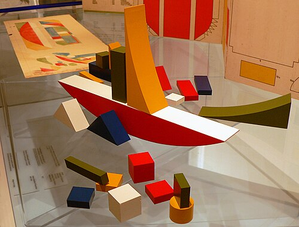

# Contexto de Design

## 1. Resumo / Abstract

### Resumo (PT)

A marca Nestor apresenta uma coleção de brinquedos educativos modulares em madeira focados no desenvolvimento cognitivo, na sustentabilidade e na exploração  visual e experimental através da luz e sombra. Esta marca é guiada pelo princípio de desperdício zero, ao usar os restos da máquina CNC. A coleção divide-se em abordagens complementares que estimulam o pensamento tridimensional, a física e a brincadeira livre. 

Com isto, as temáticas foram divididas por idades de forma a que haja um acompanhamento por fases (idades) e para que a marca consiga crescer junto com as crianças.

O primeiro projeto, *Mar de Formas*, estabelece as bases da coordenação motora, da associação cromática e do raciocínio lógico por meio de encaixes por empilhamento.

Evoluindo para a desconstrução das formas, o projeto *Texturitas* foca-se na retirada intencional do material, através de um sistema de peças em forma de U que se sobrepõem por fricção. As peças contêm contornos arredondados, rasgos e perfurações simulando as texturas orgânicas da natureza. Este procura trabalhar o conhecimento visual e físico das sombras.

Com a máxima liberdade, o projeto *Informal* destaca-se por ter um encaixe tridimensional e livre, seguindo também as formas orgânicas que convidam as crianças a decifrar silhuetas projetadas através de cartas de desafio. 

Por fim, *Rascunho* disponibiliza uma caixa com o intuito de tela, perfurada em grelha, que atua como suporte de encaixe para as peças. As crianças podem montar as suas pinturas de sombras.

### Abstract (EN)

The Nestor brand presents a collection of modular wooden educational toys focused on cognitive development, sustainability, and visual and experimental exploration through light and shadow. This brand is guided by the principle of zero waste, using leftover CNC machine parts. The collection is divided into complementary approaches that stimulate three-dimensional thinking, physics, and free play.

Therefore, the themes are divided by age so that there is accompaniment through different phases (ages) and so that the brand can grow along with the children.

The first project, *Sea of ​​Shapes*, establishes the foundations of motor coordination, chromatic association, and logical reasoning through stacking and interlocking.

Evolving towards the deconstruction of forms, the *Texturitas* project focuses on the intentional subtraction of material, through a system of U-shaped pieces that overlap by friction. The pieces contain rounded contours, slits, and perforations simulating the organic textures of nature. This aims to work on the visual and physical knowledge of shadows.

With maximum freedom, the *Informal* project stands out for its free, three-dimensional design, also following organic forms that invite children to decipher silhouettes projected through challenge cards.

## 2. Referências Coletivas

### 2.1. Recolha de Objetos a Redesenhar/Remisturar

Catálogo de objetos de partida que o grupo identificou para o redesenho. Para cada objeto: imagem, origem, motivo da escolha.

*Objeto 1*

**Objeto 1**  

**Origem:** Alemanha (1923) 

**Autoria**: Alma Siedhoff-Buscher

**Razão da escolha**: Selecionado pelo minimalismo e pelas formas modulares. Também serviu para a seleção do número de peças de alguns brinquedos. Serviu de base conceptual para a marca entender que a partir de poucas peças é possível ter uma brincadeira que cativa a imaginação e criatividade das crianças.

*Objeto 2*

**Objeto 2** 

**Origem:** Portugal (2026) 

**Autoria**: Projeto autoral | Desconforto

**Razão da escolha**: Selecionado pela forma como as sombras da peça interagem na parede e pelas formas circulares.
### 2.2. Moodboard

Painel de referências visuais e conceptuais que orientam a estratégia do grupo.

