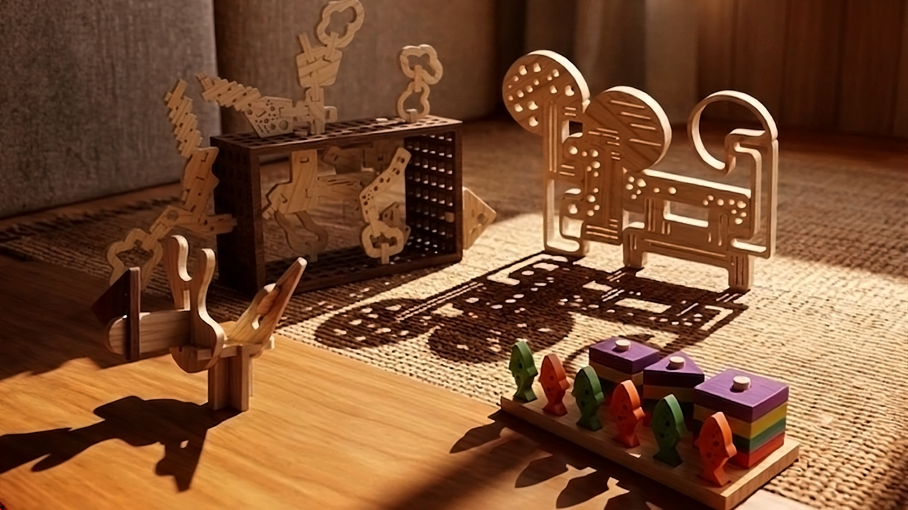
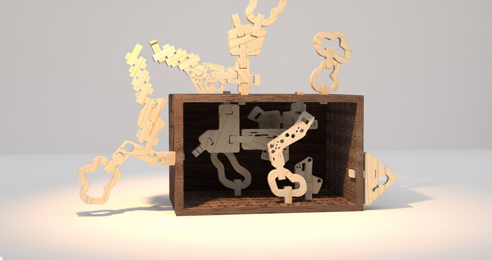
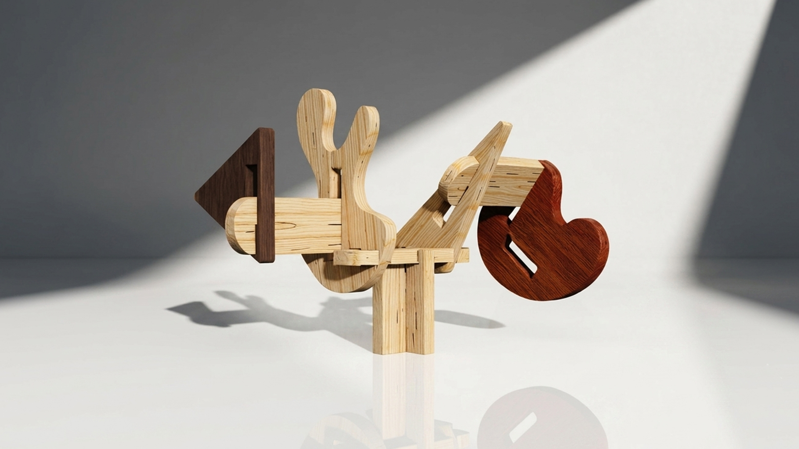
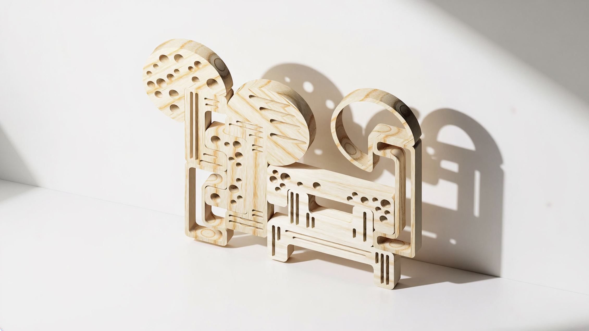

# Sombras

> Uma coleção de brinquedos que trabalha as sombras através da montagem livre de peças orgânicas e minimalistas. 

## Elementos do Grupo

| Número  | Nome             |
| ------- | ---------------- |
| 2024279 | Mafalda Carvalho |
| 2024342 | Maria Antónia N. |
| 2024566 | Maria Inês M.    |
| 2023509 | Sabrina Silva    |

---

## Contexto de Design

*Imagem gerada com Firefly 5 - Photoshop*

A linha de produtos da marca Nestor interliga-se pela união da exploração da brincadeira através da luz e projeção de sombras. O conceito comum que influencia toda a coleção é a transformação de figuras tridimensionais, com volume, em estímulos visuais, sem volume, através da projeção da luz, com a ajuda de lanternas físicas ou até mesmo os telefones. Por meio destas formas é possível construir cenários e histórias em ambientes de lazer.

Como temáticas esta gama de brinquedos trabalha as diferentes idades, com objetivo de ter um acompanhamento do crescimento das crianças, adaptando-se de forma progressiva às suas necessidades. Intencionalmente, estes quatro produtos buscam o crescimento. 

A etapa inicial é o Mar de Formas, que concentra-se no simples empilhamento na orientação vertical. *Texturitas* e *Informal* introduzem encaixes por fricção exigindo uma maturidade cognitiva. Por último, *Rascunho* representando desafios através da narrativa das sombras.

Resumo, referências coletivas e moodboard do grupo encontram-se em [contexto.md](contexto.md).

[Ver contexto completo →](contexto.md)

---

## Galeria de Produtos

<!-- Cada thumbnail liga à página individual de cada produto.
     Cada produto vive em produtos/<numero>-<nome>/index.md
     e tem uma sub-página produtos/<numero>-<nome>/processo.md -->

<!-- markdownlint-disable MD033 -->

  <!-- duplicar o bloco abaixo para cada produto do grupo -->

  <a class="gallery-card" href="produtos/mafalda/">
    
    <h3>Mar de Formas</h3>
    
Mafalda

  </a>
    <a class="gallery-card" href="produtos/maria_ines/">
    
    <h3>Rascunho</h3>
    
Maria Inês

  </a>
  <a class="gallery-card" href="produtos/maria_antonia/">
    
    <h3>Informal</h3>
    
Maria Antónia

  </a>
    <a class="gallery-card" href="produtos/sabrina/">
    
    <h3>Texturitas</h3>
    
Sabrina

  </a>

  <!-- duplicar o bloco acima para cada produto do grupo  e substituir _modelo em ambas por <numero>-<nome> -->

<!-- markdownlint-enable MD033 -->
