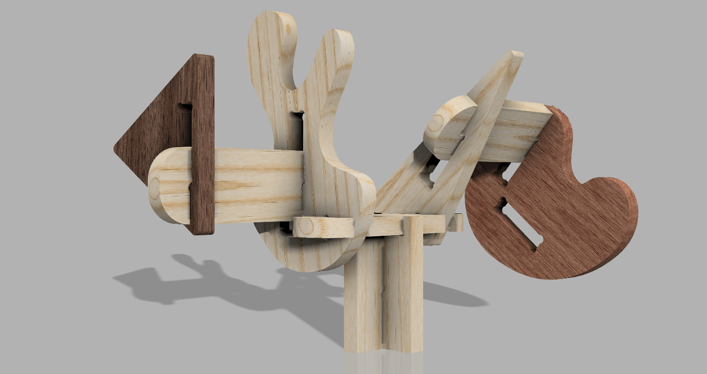

# Sombras

> Substituam este parágrafo por uma frase de apresentação do grupo (uma linha, conceptualmente forte). A imagem de capa acima (`attachments/hero.jpg`) deve ser uma **fotografia de conjunto** dos trabalhos do grupo, mais conceptual, que espelhe a estratégia coletiva.

## Elementos do Grupo

| Número  | Nome             |
| ------- | ---------------- |
| 2024279 | Mafalda Carvalho |
| 2024342 | Maria Antónia N. |
| 2024566 | Maria Inês M.    |
| 2023509 | Sabrina Silva    |

---

## Contexto de Design

> Nesta zona pretenderão mostrar o que relaciona estes produtos que apresentam na galeria - a temática, conceito comum, objectivos comuns, brincadeiras (funções) comuns, entre outros...

(devem colocar imagens no corpo a qq momento, bastará que as arrastem para aqui.)

Resumo, referências coletivas e moodboard do grupo encontram-se em [contexto.md](contexto.md).

[Ver contexto completo →](contexto.md)

---

## Galeria de Produtos

<!-- Cada thumbnail liga à página individual de cada produto.
     Cada produto vive em produtos/<numero>-<nome>/index.md
     e tem uma sub-página produtos/<numero>-<nome>/processo.md -->

<!-- markdownlint-disable MD033 -->

  <!-- duplicar o bloco abaixo para cada produto do grupo -->

  <a class="gallery-card" href="produtos/mafalda/">
    
    <h3>Nome do Produto</h3>
    
Mafalda

  </a>
    <a class="gallery-card" href="produtos/maria_ines/">
    
    <h3>Rascunho</h3>
    
Maria Inês

  </a>
  <a class="gallery-card" href="produtos/maria_antonia/">
    
    <h3>Informal</h3>
    
Maria Antónia

  </a>
    <a class="gallery-card" href="produtos/sabrina/">
    
    <h3>Texturitas</h3>
    
Sabrina

  </a>

  <!-- duplicar o bloco acima para cada produto do grupo  e substituir _modelo em ambas por <numero>-<nome> -->

<!-- markdownlint-enable MD033 -->
