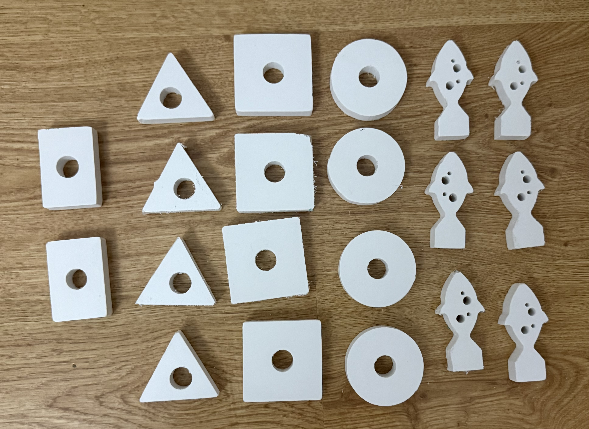
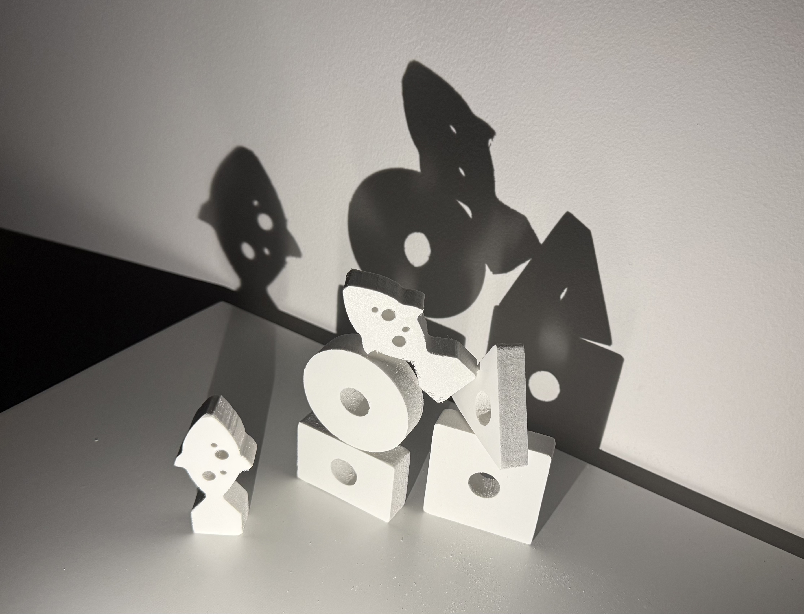
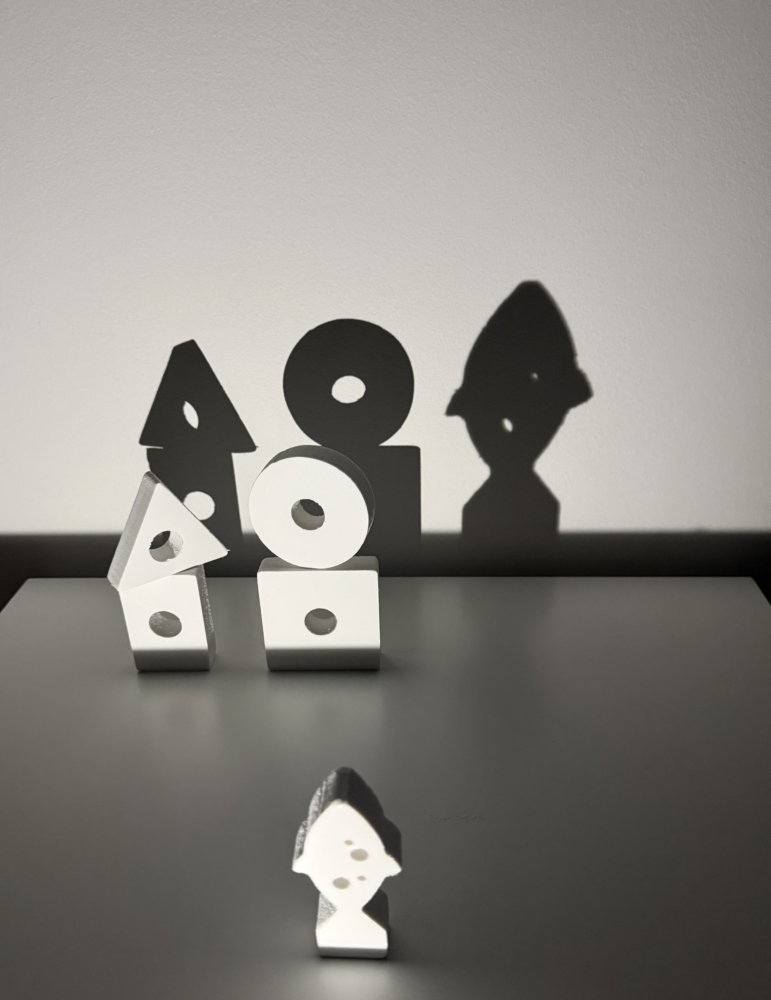
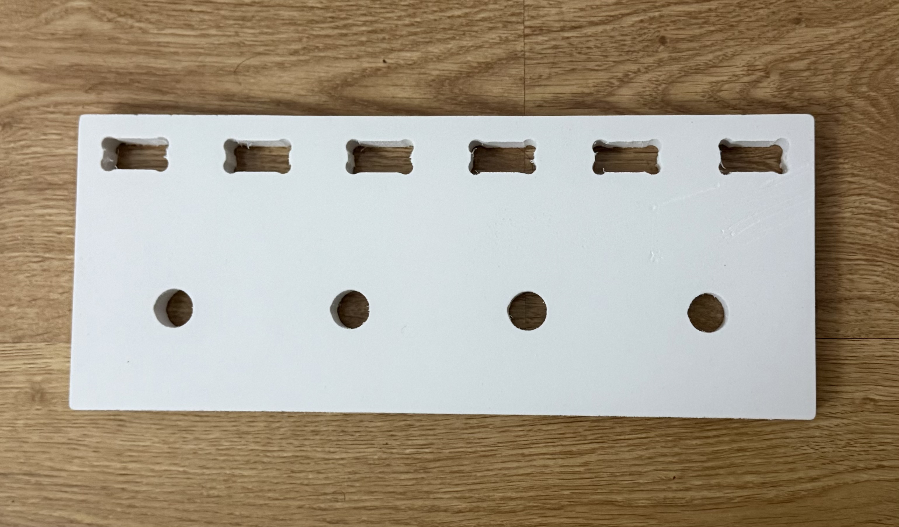
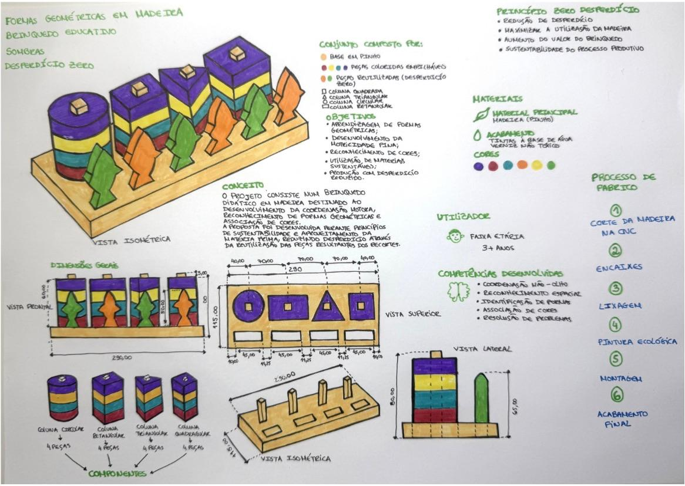
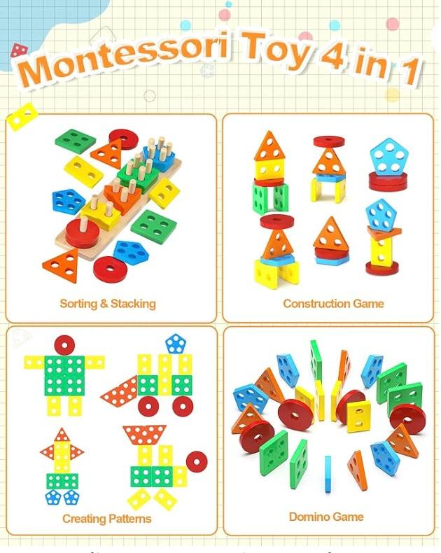
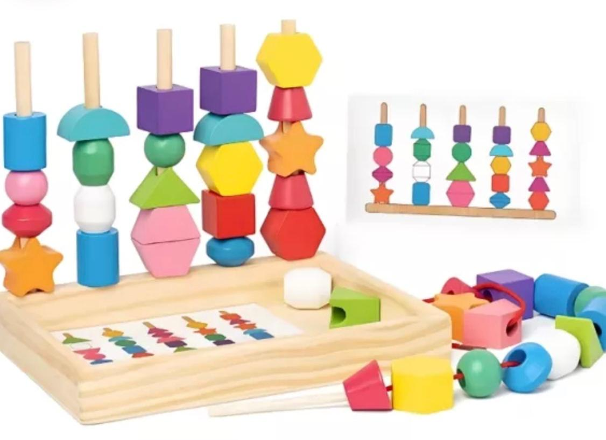

# Processo

## 1. Protótipo(s)

Protótipo Final - Feito em PVC, com espessura de 15mm.  
Só realizei o corte uma vez. Resultaram os elementos das figuras geométricas e marinhas.

## 2. Processo de Prototipagem

Felizmente, com a colaboração da minha colega de grupo, Sabrina Silva, foi-me dada a possibilidade de cortar o meu protótipo fora do ambiente escolar, na CNC Router da empresa Red Sky.  

Desenvolvi no programa Autodesk Fusion o modelo digital e a preparação do mesmo para o corte. Depois foi o corte automático realizado pela CNC da placa de 600 x 600mm. No fim do corte, com uma lixa limei todos os cantos e superfícies das peças.

## 3. Protótipos Exploratórios

Só fiz o corte uma única vez.  
As medidas dos buracos para encaixes não resultaram, nem a forma dos pilares arredondada, no entanto, no Fusion foi atualizado.

## 4. Modelos 3D

https://a360.co/4oyLEqo 
https://a360.co/43C7rUp
## 5. Outros Modelos

Modelos físicos exploratórios, em cartão, espuma, madeira de teste.
## 6. Esboços e Pranchas-Resumo

Durante o processo fiz imensas alterações nas medidas de encaixe e das próprias peças, porque as iniciais não estavam com as contas bem feitas.

## 7. Pesquisa

### 7.1. Aspectos valorizados do moodboard, desconstrução da forma (o que distingue o programa formal)

Durante a fase de pesquisa analisei brinquedos educativos em madeira, metodologias Montessori e produtos sustentáveis destinados à idade de + 3 anos.  
Valorizei os principais aspetos como a utilização de materiais naturais e sustentáveis, o design simples e intuitivo, as cores vivas para estimular a percepção visual, o desenvolvimento da coordenação motora fina, a aprendizagem através da experimentação e manipulação, a segurança e ergonomia adequadas a crianças a partir dos 3 anos, a durabilidade e resistência do produto e o conceito ecológico associado à redução de desperdícios.  
  
O brinquedo resulta da combinação e simplificação de formas geométricas básicas como o círculo, o quadrado, o triângulo e o rectângulo. Estas formas, estão sempre como elementos separados para permitir a exploração tátil e visual por parte da criança.  
  
A organização das formas em colunas verticais facilita a identificação das diferenças geométricas e promove a aprendizagem através do encaixe e da manipulação. Foram criadas peças de figuras como o peixe para criar cenários e promover a utilização das sombras para tornar o jogo educativo mais divertido.  
  
O programa formal distingue-se pela utilização de formas geométricas facilmente reconhecíveis. As principais características são a geometria simples, volume adequado, forte legibilidade visual, repetição modular, proporções adequadas à escala infantil, e contraste cromático.  
O objeto surge da relação entre as formas geométricas e as formas secundárias, criando um conjunto coerente e pedagogicamente enriquecedor.

### 7.2. Objetos de referencia

  
Brinquedo de madeira montessoriano de encaixe de formas e cores  
  
Empilhamento vertical  
Coordenação motora  
Aprendizagem autónoma 

Diferenciação geométrica  
Exploração tátil  
  
  
Brinquedo educativo de madeira  
  
Reconhecimento de figuras básicas  
Associação entre forma e encaixe  
Desenvolvimento cognitivo  
Facilidade de utilização  
Perceção espacial

## 8. Outros Elementos

Outros materiais relevantes para a preparação do conceito (entrevistas, observação, testes com utilizadores, notas, leituras, inspirações).
