# Processo

> Organizado do **mais recente** para o **mais antigo**. Faz uma seleção que torne clara, aprazível e detalhada a evolução do produto e das ideias.

## 1. Protótipo(s)

<u>**Protótipo Final**</u>

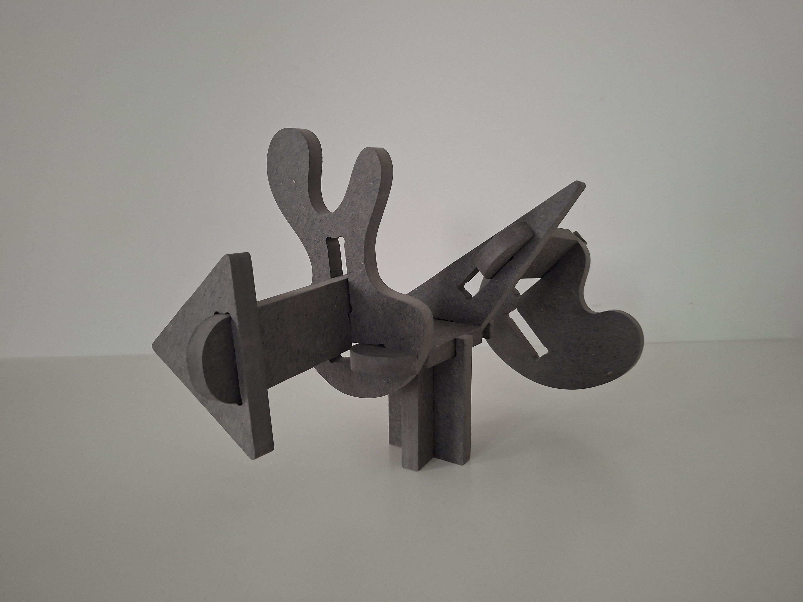
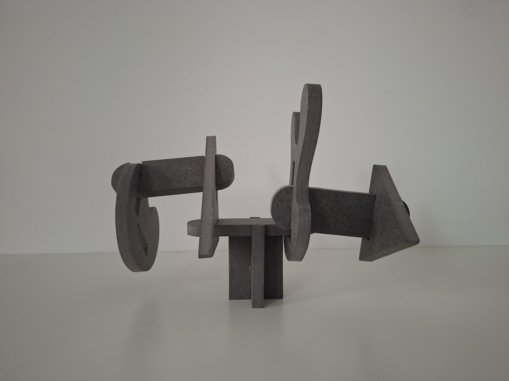
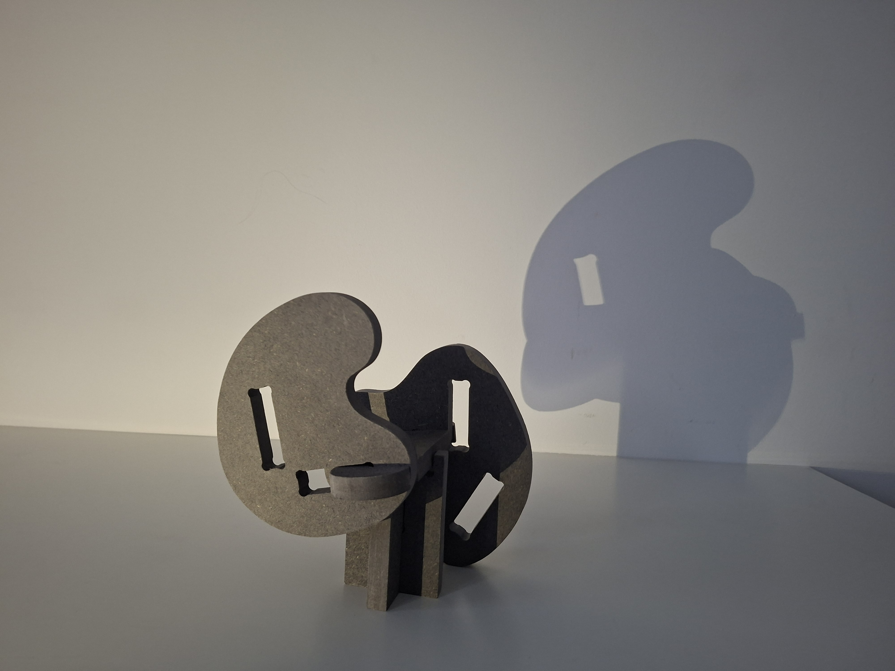
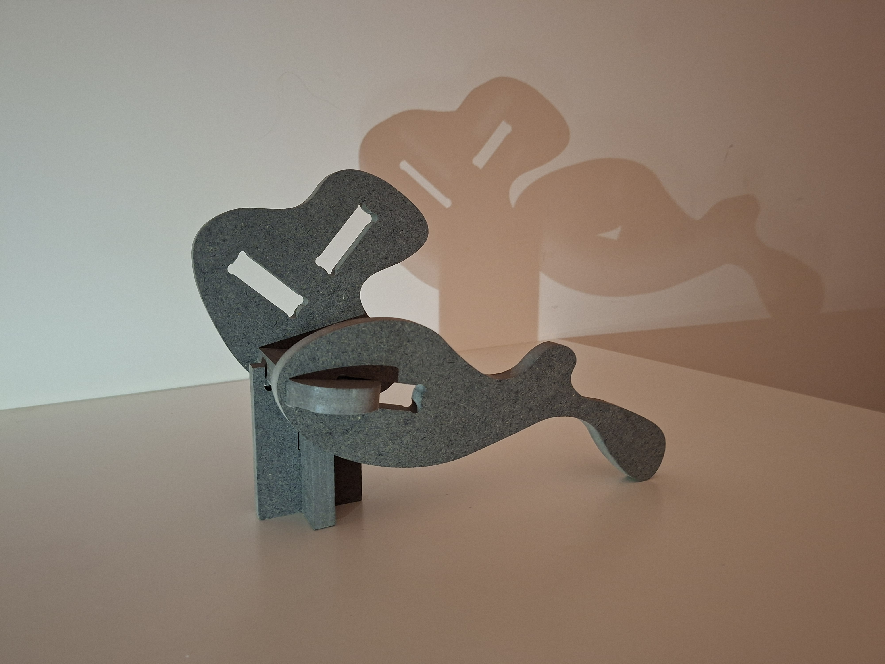
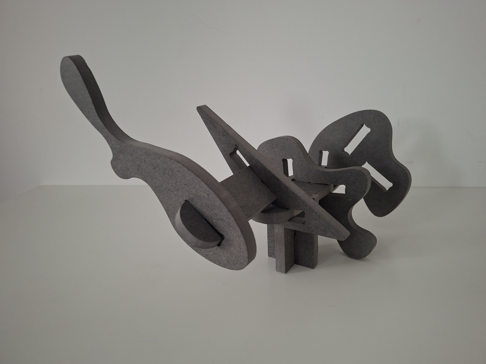
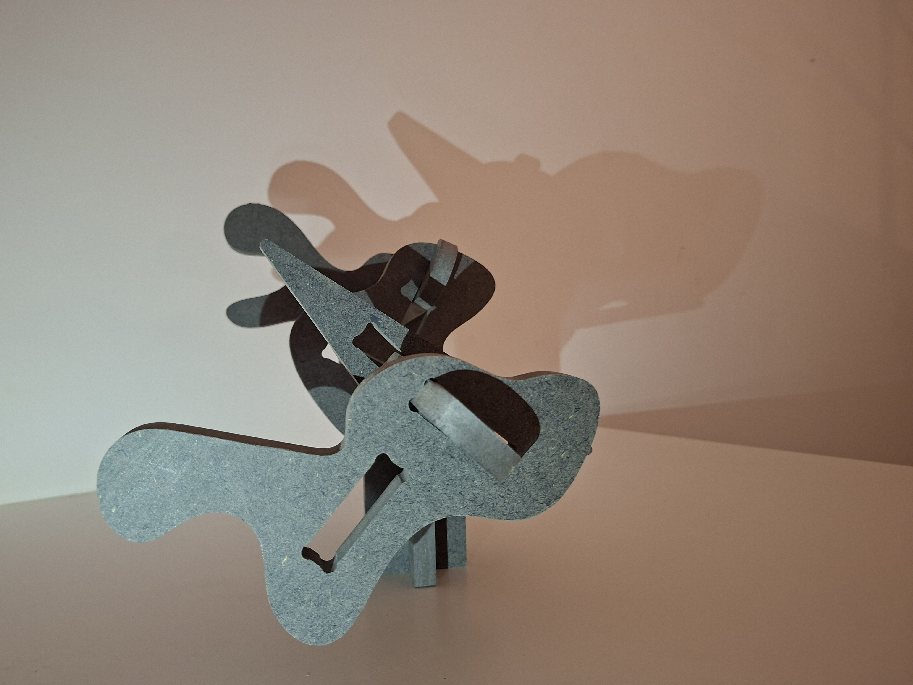
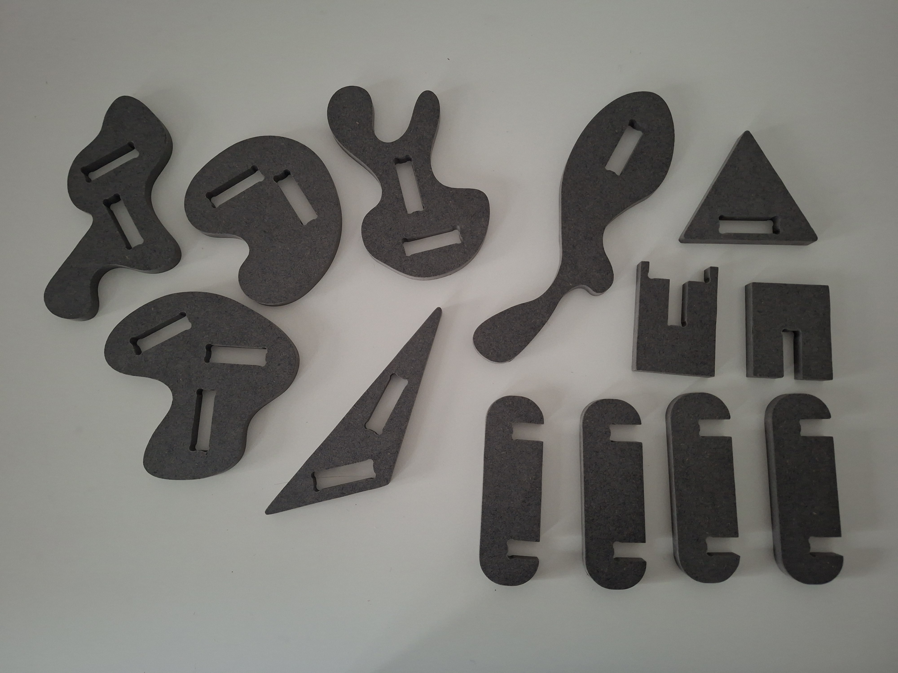

<u>**Cartas**</u>

<u>**Protótipo na Embalagem**</u>

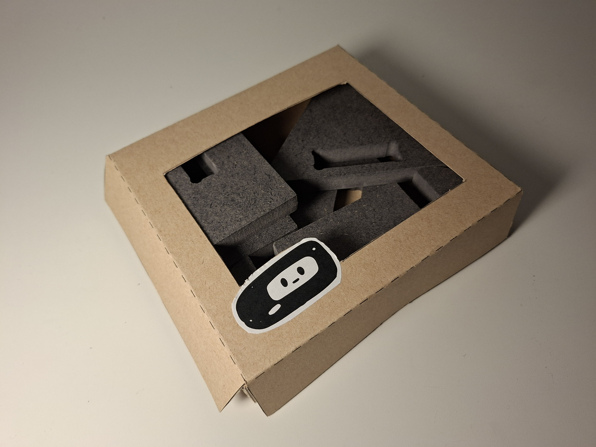

## 2. Processo de Prototipagem

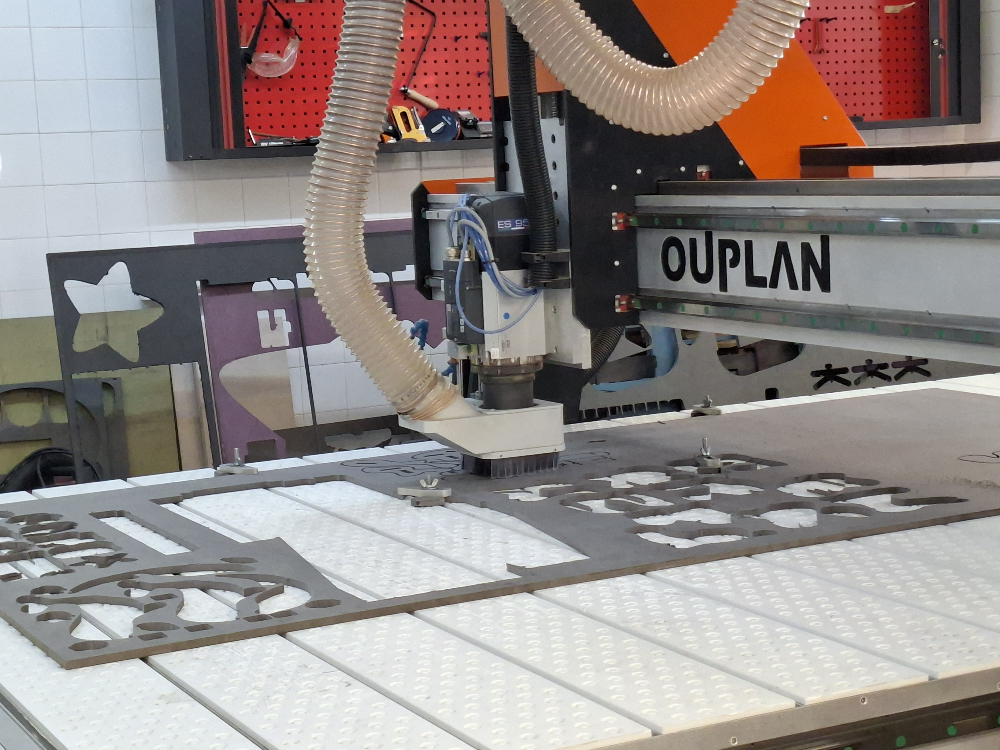

 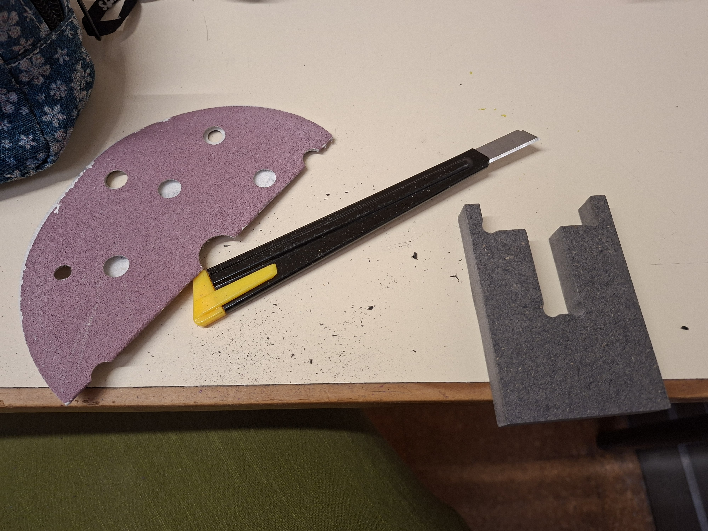 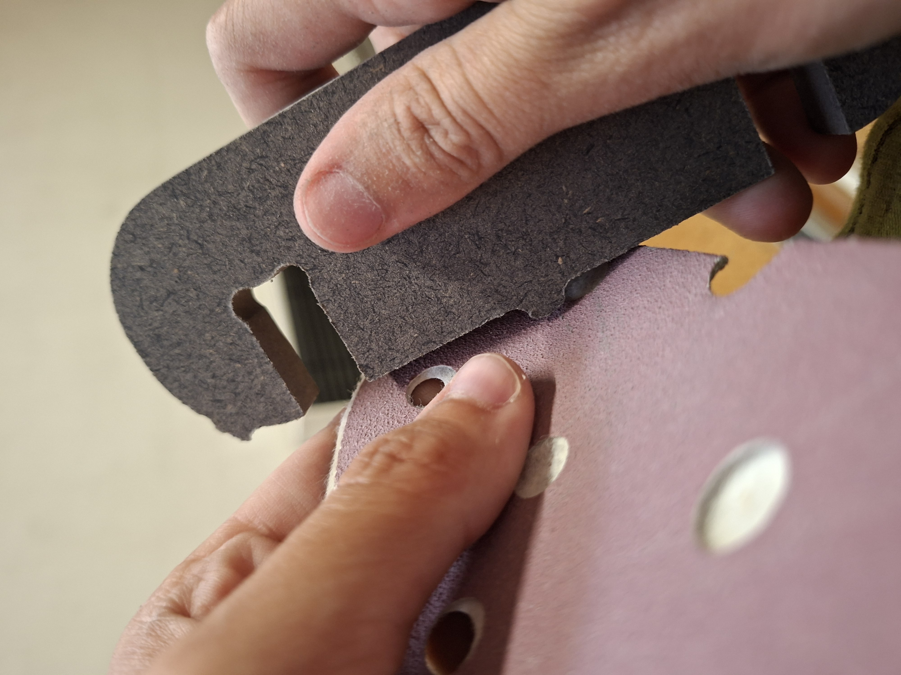 

## 3. Protótipos Exploratórios

Testes CNC prévios, ensaios em escala, experiências de juntas/encaixes.

## 4. Modelos 3D

Embed do Fusion (visualização do modelo paramétrico).

https://a360.co/4nqYoPa

## 5. Outros Modelos

Modelos físicos exploratórios, em cartão, espuma, madeira de teste.

## 6. Esboços e Pranchas-Resumo

Desenhos manuais, 
pranchas A3 de síntese, 
exploração de variantes.

## 7. Pesquisa

### 7.1. Aspectos valorizados do moodboard, desconstrução da forma (o que distingue o programa formal)

### 7.2. Objetos de referencia

Inventário de precedentes, brinquedos análogos, referências históricas.

## 9. Outros Elementos

Outros materiais relevantes para a preparação do conceito (entrevistas, observação, testes com utilizadores, notas, leituras, inspirações).
