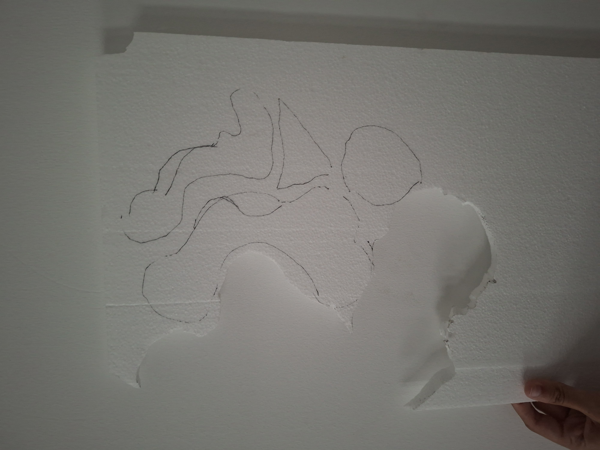

# Processo

> Organizado do **mais recente** para o **mais antigo**. Faz uma seleção que torne clara, aprazível e detalhada a evolução do produto e das ideias.

## 1. Protótipo(s)

<u>**Protótipo Final**</u>

<u>**Cartas**</u>

<u>**Protótipo na Embalagem**</u>

## 2. Processo de Prototipagem

O corte do protótipo foi realizado na fresadora CNC OUPLAN STEEL 3020 no Fablab na ESELx, numa placa MDF (Medium Density Fiberboard) com 12 mm de espessura, ocupando espaço de 500 mm x 400 mm.

Para corta tive o auxílio do professor para colocar a CNC a trabalhar. Após o corte espirei o pó criado pela máquina durante o processo. 

Já  em casa com uma lima de madeira e um x-ato eliminei as imperfeições.

   

## 3. Protótipos Exploratórios

Durante o período de aulas de desenvolvimento e testes de protótipos, o  professor usou o meu projeto como exemplo para a turma de como fazer o modelo 3D no Autodesk Fusion e o processo de corte. 

Esta oportunidade concedeu-me o aconselhamento do professor, o mesmo ao avaliar a minha prancha-resumo sugeriu que deveria haver melhorias para o tipo de encaixe que estava a usar para conectar as peças e estabilizá-las, já a proposta inicial era instável e insegura.

Após o professor ter dito isso, tentei elaborar novos possíveis tipos de encaixe, mas quando o professor usou o meu projeto de exemplo, o próprio sugeriu que eu deveria usar um encaixe tipo gancho.

Devido à segurança e facilidade de montagem, decidi continuar com ele.

As imagens abaixo são o protótipo usado como exemplo para a minha turma.

Ele não só permitiu ter uma melhor noção do tipo de encaixe em que iria trabalhar no restante do processo, mas também entender a importância da folga, já neste exemplo, devido à quase inexistente folga, o encaixe não conseguiu entrar dentro da peça.

   

## 4. Modelos 3D

https://a360.co/4vpjsbM 
https://a360.co/4nV0UNK

## 5. Outros Modelos

Antes de passar o brinquedo para o Fusion, realizei algumas maquetes rápidas em papel para verificar se a minha ideia iria funcionar.

Antes da aula anteriormente mencionada, realizei uma maquete com os encaixes antigos para testar os encaixes e estudar quase que forma seriam mais interessantes ao serem expostos à luz.

   

Após a aula, comecei a desenvolver o meu brinquedo no Autodesk Fusion, comecei por fazer os encaixes, pois pensava fazer mais um protótipo antes do final para ter garantia de que os encaixes estavam a funcionar bem.

No meio do processo, repliquei uma nova ideia de encaixes para estabilizar o brinquedo. Este foi um encaixe em formato de “+” que servia como suporte para o encaixe gacho central que por sua vez aguenta todo o equilíbrio do brinquedo. Na dúvida de como deveriam fazer o encaixe entre eles, fiz uma maquete rápida de papel para confirmar as minhas suspeitas. Infelizmente perdi a maquete. 

Por fim, com medo do problema da folga, tentei fazer uma maquete com esferovite, mas devido a minhas dificuldades em acender o isqueiro desisti de concluir a maquete e decidi me focar em fazer protótipos.

## 6. Esboços e Pranchas-Resumo

**<u>**Pracha-resumo Final**</u>

## 7. Pesquisa

### 7.1. Aspectos valorizados do moodboard, desconstrução da forma (o que distingue o programa formal)

### 7.2. Objetos de referencia

Inventário de precedentes, brinquedos análogos, referências históricas.

## 9. Outros Elementos

Outros materiais relevantes para a preparação do conceito (entrevistas, observação, testes com utilizadores, notas, leituras, inspirações).
