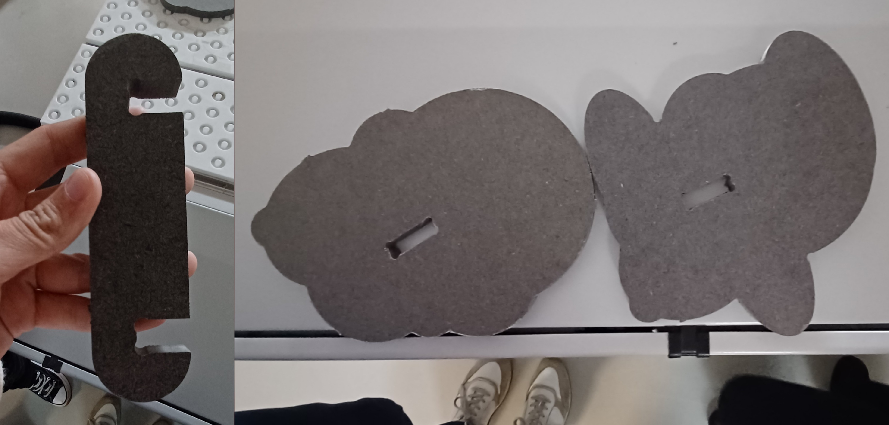
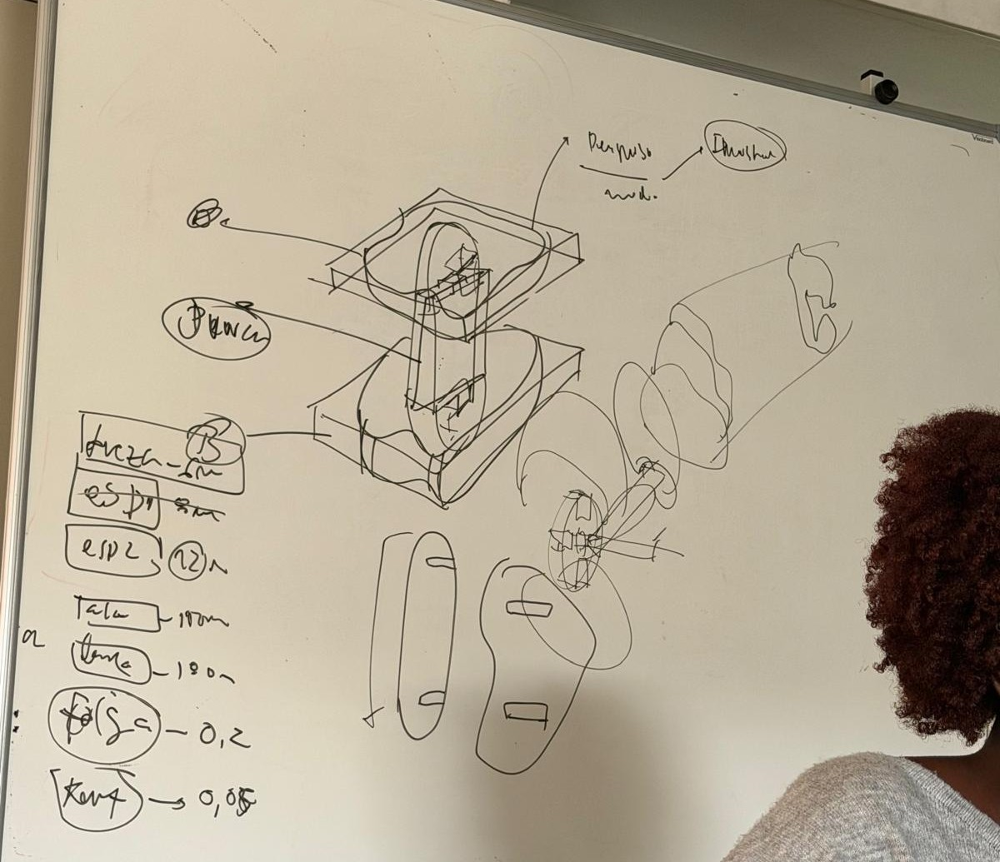
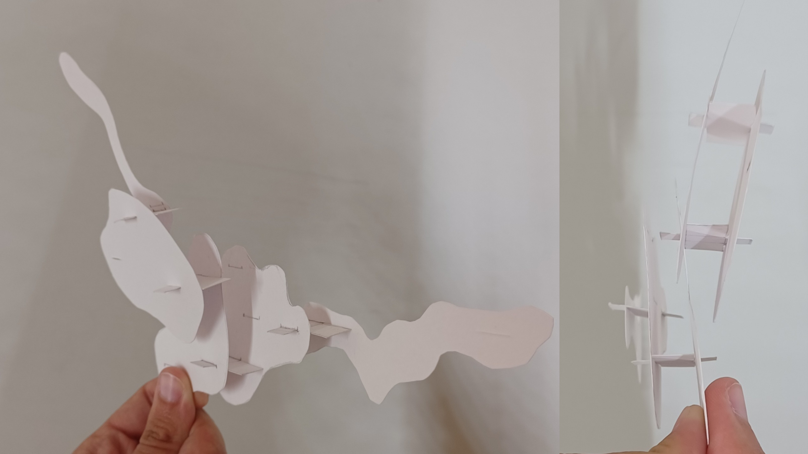
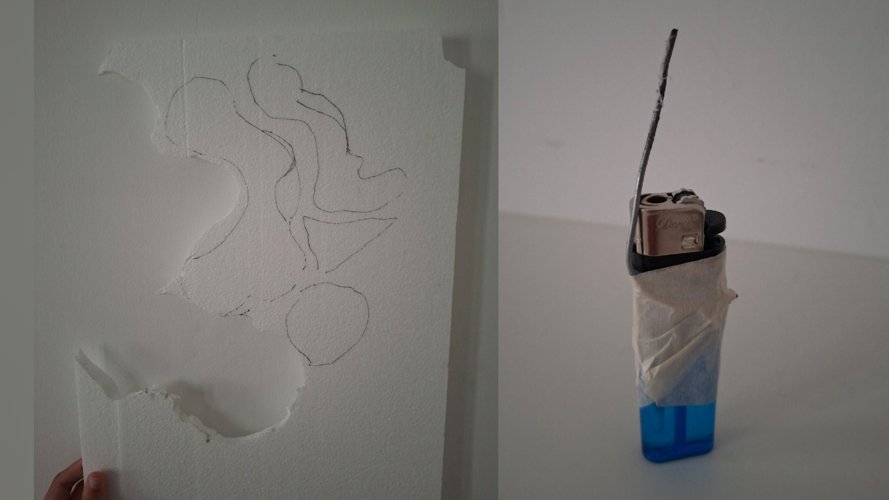
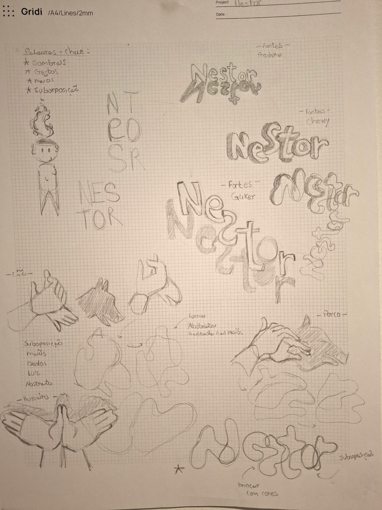
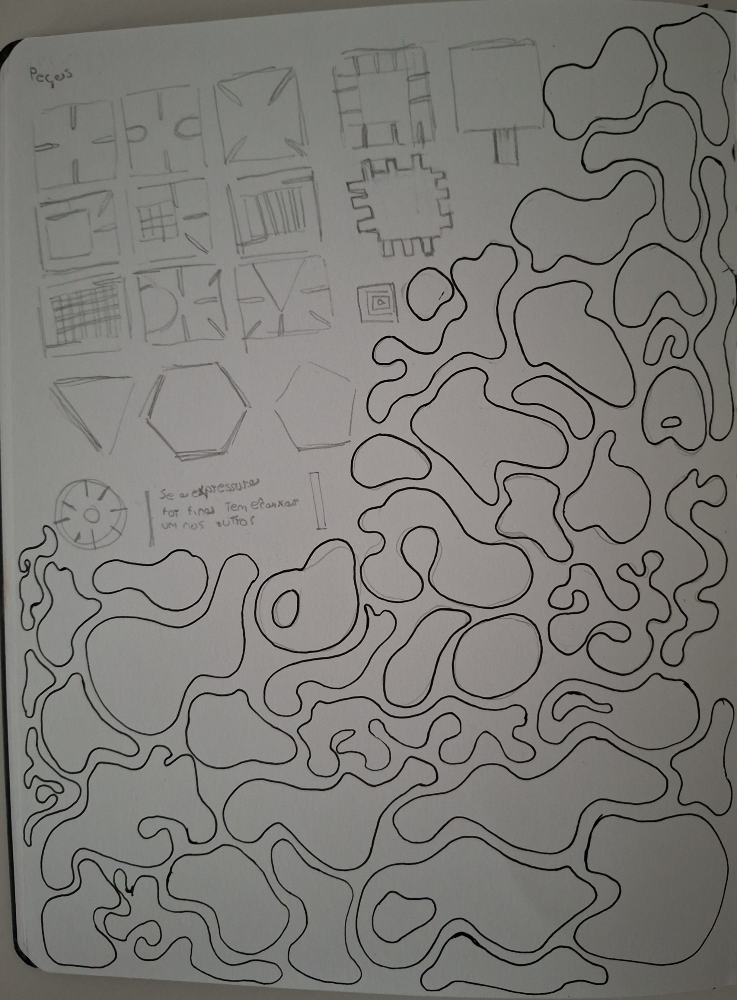
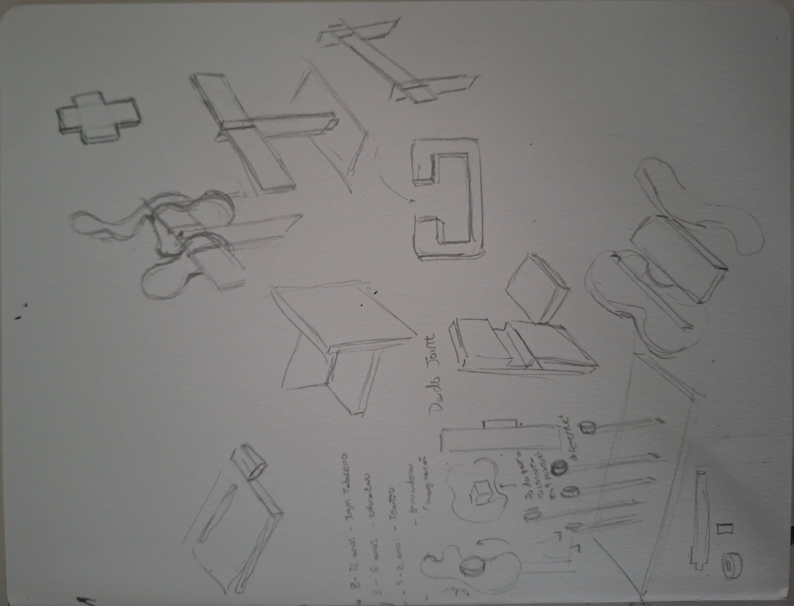
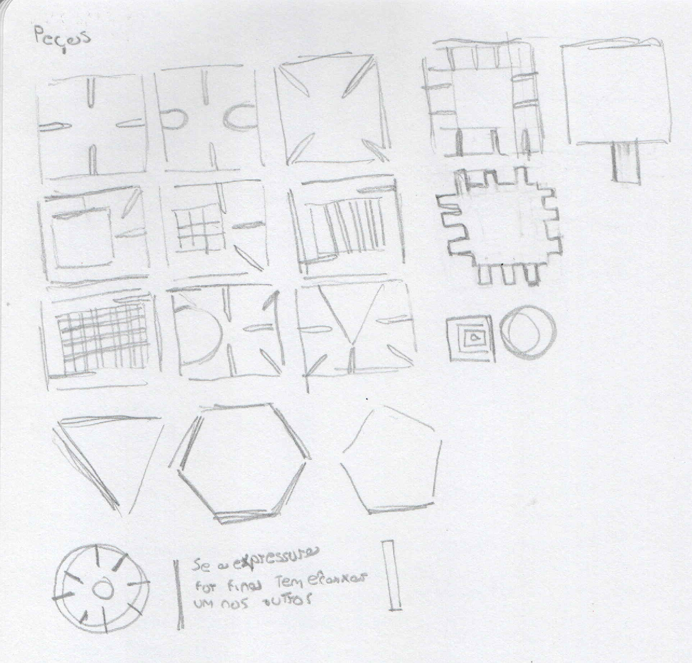

# Processo

> Organizado do **mais recente** para o **mais antigo**. Faz uma seleção que torne clara, aprazível e detalhada a evolução do produto e das ideias.

## 1. Protótipo(s)

<u>**Protótipo Final**</u>

<u>**Cartas**</u>

<u>**Protótipo na Embalagem**</u>

## 2. Processo de Prototipagem

O corte do protótipo foi realizado na fresadora CNC OUPLAN STEEL 3020 no Fablab na ESELx, numa placa MDF (Medium Density Fiberboard) com 12 mm de espessura, ocupando espaço de 500 mm x 400 mm.

Para corta tive o auxílio do professor para colocar a CNC a trabalhar. Após o corte espirei o pó criado pela máquina durante o processo. 

Já  em casa com uma lima de madeira e um x-ato eliminei as imperfeições.

   

## 3. Protótipos Exploratórios

Durante o período de aulas de desenvolvimento e testes de protótipos, o  professor usou o meu projeto como exemplo para a turma de como fazer o modelo 3D no Autodesk Fusion e o processo de corte. 

Esta oportunidade concedeu-me o aconselhamento do professor, o mesmo ao avaliar a minha prancha-resumo sugeriu que deveria haver melhorias para o tipo de encaixe que estava a usar para conectar as peças e estabilizá-las, já a proposta inicial era instável e insegura.

Após o professor ter dito isso, tentei elaborar novos possíveis tipos de encaixe, mas quando o professor usou o meu projeto de exemplo, o próprio sugeriu que eu deveria usar um encaixe tipo gancho.

Devido à segurança e facilidade de montagem, decidi continuar com ele.

As imagens abaixo são o protótipo usado como exemplo para a minha turma.

Ele não só permitiu ter uma melhor noção do tipo de encaixe em que iria trabalhar no restante do processo, mas também entender a importância da folga, já neste exemplo, devido à quase inexistente folga, o encaixe não conseguiu entrar dentro da peça.

## 4. Modelos 3D

https://a360.co/4vpjsbM 
https://a360.co/4nV0UNK

## 5. Outros Modelos

Antes de passar o brinquedo para o Fusion, realizei algumas maquetes rápidas em papel para verificar se a minha ideia iria funcionar.

Antes da aula anteriormente mencionada, realizei uma maquete com os encaixes antigos para testar os encaixes e estudar quase que forma seriam mais interessantes ao serem expostos à luz.

Após a aula, comecei a desenvolver o meu brinquedo no Autodesk Fusion, comecei por fazer os encaixes, pois pensava fazer mais um protótipo antes do final para ter garantia de que os encaixes estavam a funcionar bem.

No meio do processo, repliquei uma nova ideia de encaixes para estabilizar o brinquedo. Este foi um encaixe em formato de “+” que servia como suporte para o encaixe gacho central que por sua vez aguenta todo o equilíbrio do brinquedo. Na dúvida de como deveriam fazer o encaixe entre eles, fiz uma maquete rápida de papel para confirmar as minhas suspeitas. Infelizmente perdi a maquete. 

Por fim, com medo do problema da folga, tentei fazer uma maquete com esferovite, mas devido a minhas dificuldades em acender o isqueiro desisti de concluir a maquete e decidi me focar em fazer protótipos.

## 6. Esboços e Pranchas-Resumo

<u>**Pracha-resumo Final**</u>

Após um longo processo de desenvolvimento durante o semestre, este foi o protótipo final do briquendo, mas como referido anteriormente, ele sofreu várias alterações até chegar a este ponto.

As principais alterações sofreram melhorias até a sua versão anterior, fora a melhora dos encaixes entre as peças, que permitem o equilíbrio total do brinquedo, tal como a escolha definitiva das suas formas.

<u>**Esboços**</u>
.png)
%201.png)

  
<u>**Segunda Proposta de Prancha-resumo**</u>

Esta proposta de brinquedo foi a combinação das sugestões e melhorias feitas pelo professor em relação à minha proposta inicial. 

O grande problema apontado pelo professor foi a forçação da sombra no brinquedo e o tipo de formas que eu estava a usar não era das melhores para trabalhar com a subposição das sombras.

Por isso peguei na ideia original, a primeira proposta, e criei um jogo de cartas, baseadas nos gestos, onde a pessoa teria de adivinhar o tema a partir da sombra criada pelo objeto, deixando de ser forçado, e fazendo parte do jogo.

Ao pensar que tipo de forma iria usar, originalmente, pensei em usar formas geométricas, mas com a conversa do professor, sobre como as mãos em subposição criam uma forma nova ao serem projetadas,  mudei de planos. 

Isto inspirou-me no estudo de desenvolvimento do logotipo no módulo de Design de Comunicação, onde estudei esse fenômeno da subposição das mãos. Esta experiência levou-me às formas orgânicas abstratas.

Mais tarde chegaria a criar um logotipo inspirado nessas formas, mas ele não seguiu para frente como final.

  

Outro ponto importante desta versão, como falado anteriormente, foi os encaixes.

Encaixe entre peças um simples retângulo com dois dos lados com um dente, que encaixa numa abertura à forma, este encaixe é o da maquete de papel. Foi removida devido a sua inatabilidade e recomendação do professor.

Outra peça a destacar são as peças de estabilização, que nesta altura tinham, juntas, a forma de uma força. (esboço na parte superior da prancha resumo). 

Foi remodelada pelo mesmo motivo da anterior.

  

<u>**Primeira Proposta de Prancha-resumo**</u>

Por fim, a primeira proposta apresentada, tal como anterior, é um jogo de cartas, que ao tirar uma carta do baralho, ela teria um desenho de uma silhueta, os jogadores deveriam montar o brinquedo com base na própria silhueta para chegar o mais próximo possível do da carta.

Ao criar estas peças inspirei-me nos brinquedos que se ligavam entre si, baseando-me em formas mais quadradas para distanciar-me do projeto de uma das minhas colegas, com medo de que fosse muito similar.

Aqui os encaixes seriam tipo dentes em todas as suas laterais.

Descartei pelos motivos anteriormente mencionados, mas principalmente pelas limitações da forma.  

## 7. Pesquisa

### 7.1. Aspectos valorizados do moodboard, desconstrução da forma (o que distingue o programa formal)

### 7.2. Objetos de referencia

Inventário de precedentes, brinquedos análogos, referências históricas.

## 8. Outros Elementos

Outros materiais relevantes para a preparação do conceito (entrevistas, observação, testes com utilizadores, notas, leituras, inspirações).
