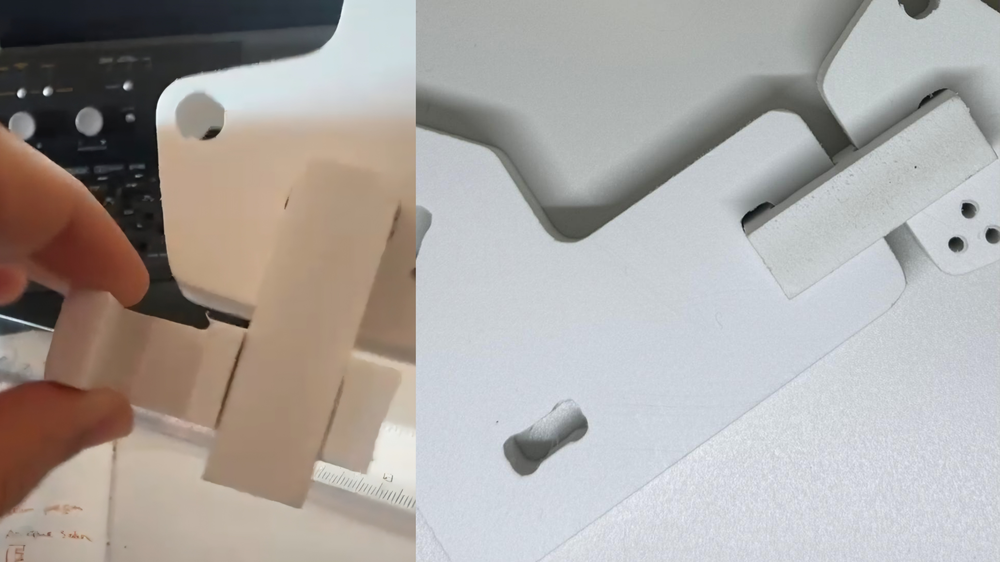
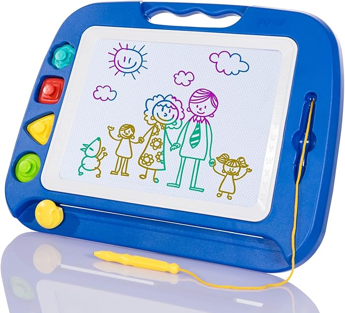
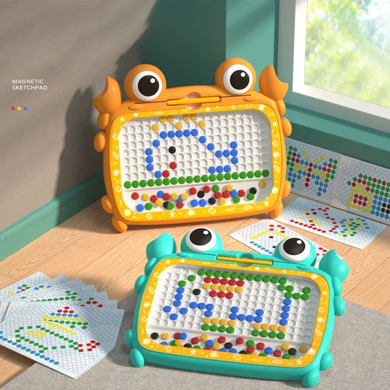
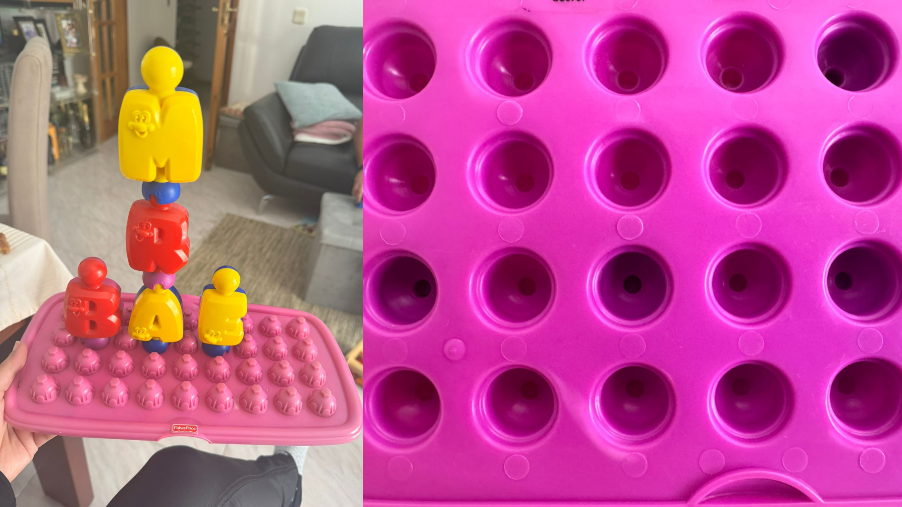

# Processo

## 1. Protótipo(s)

Protótipo Final - Feito em placa PVC e placa de madeira de pinho contraplacado, ambos com espessura de 15 mm.
Infelizmente não tive possibilidade de cortar paredes da caixa e mais peças, devido ao seu enorme tamanho das paredes e à falta de materiais.
.jpeg)
*Protótipo Final*

.jpeg)

.jpeg)
*Encaixes em E*

.jpeg)

## 2. Processo de Prototipagem

Graças à minha colega de grupo, Sabrina, permitiu-me ter a flexibilidade de fazer testes e cortar o meu protótipo fora do ambiente escolar, na CNC Router da empresa Red Sky.

O procedimento de corte foi simples: desenvolvimento do modelo digital no programa Autodesk Fusion e a preparação do mesmo para corte; depois o corte automático realizado pela CNC do restante da placa de 600 x 600 mm; após o corte, com uma lixa limei cuidadosamente as superfícies das peças tendo dificuldades nas partes mais estreitas.

Infelizmente, como dito anteriormente, não consegui cortar as paredes da caixa devido à falta de material.

## 3. Protótipos Exploratórios
Antes de cortar, senti a necessidade de fazer testes em PVC, para garantir a funcionalidade do brinquedo, ao testar os encaixes, antes de ser cortado em madeira.

.jpeg)

## 4. Modelos 3D

https://a360.co/4vQhiC8 
https://a360.co/4fKFlxr

<u>**Render**</u>

## 5. Outros Modelos

Antes de prosseguir para o protótipo final, achei por bem desenvolver manualmente maquetes de cartão para ter uma melhor noção das medidas das peças,  se os encaixes funcionavam corretamente, e como elas iriam reagir ao serem expostas à luz.

.jpeg)

.jpeg)
.jpeg)

## 6. Esboços e Pranchas-Resumo

<u>**Prancha-Resumo**</u>

*Prancha resumo final*

Durante o processo tive de fazer várias alterações, uma delas foi nos tipos de encaixe que estive de estar sempre a trocar, pois a minha ideia desde o início era que ele desse para usar todos os lados, mas estava com problemas nas diagonais e não estava a funcionar, depois de várias alterações acabei por chegar ao encaixe final que é uma peça à parte que parece um E.

A minha primeira versão do rascunho consistia em uma mistura mais das formas do individual e do texturitas onde as aberturas para encaixar os “E” seriam na lateral (espessura da placa), mas como nem todas as CNC têm 5 eixos e sim 3, eu optei por trocar as aberturas nas partes das faces e isso fez também com que tivesse de trocar as formas das peças.

<u>**Medidas**</u>

Em termos de medidas para as peças devido à sua forma variada não tem um tamanho específico defendido a não sei o tamanho máximo que é 12cm

A caixa, montada em formato retangular, tem 25 de altura e 40 de comprimento.

<u>**Esboços**</u>

*Esboços de nova proposta para encaixes*

.jpeg)
*Esboços e Estudos de design do brinquedo*

.jpeg)
*Esboços e Estudos de Forma das Peças*

<u>**Antigas Propostas**</u>

*Primeira Proposta de Prancha Resumo*

O meu primeiro projeto referente à primeira prancha resumo era um brinquedo para crianças de 2 anos que consistia em encaixar as peças das formas correspondentes a cada e vinha junto ainda com umas maiores, mas essas aí metia-se luz pelo buraco pequeno da peça e pelo grande saía a sombra pretendida, mas como a sombra era obrigada e não natural sendo demasiados evidentes.

.jpeg)
*Maquetes da primeira proposta, feitas com cartão e papel de alumínio*

.jpeg)
*Esboços das primeiras ideias*

.jpeg)
*Estudo dos encaixes e desenvolvimento para um nova proposta*
## 7. Pesquisa

### 7.1. Aspectos valorizados do moodboard, desconstrução da forma (o que distingue o programa formal)
O desenvolvimento do projeto baseou-se na exploração da relação entre luz, sombra e forma. Foram valorizadas formas orgânicas e simplificadas, caracterizadas por contornos suaves e recortes estratégicos que permitem a passagem da luz. A desconstrução da forma foi conseguida através da subtração de material, criando vazios que originam projeções e padrões de sombra variados. Esta abordagem confere ao objeto uma linguagem visual minimalista e lúdica, estimulando a imaginação e a interpretação livre por parte da criança.
### 7.2. Objetos de referencia

O desenvolvimento do Rascunho teve como principais referências o teatro de sombras, pela capacidade de criar narrativas através da projeção de formas e silhuetas; a pintura e a expressão artística, pela liberdade criativa e pela possibilidade de múltiplas interpretações; e os quadros magnéticos, pela construção de composições visuais a partir da organização de diferentes elementos. Estas referências contribuíram para a criação de um brinquedo que combina construção, imaginação e exploração da luz como meio de expressão.

*Teatro de sombras chinês*

*Exemplos figurativos da pintura e da expressão artística*

*Amarelo-Vermelho-Azul, 1925 - Wassily Kandinsky e Cubist Composition, 1920 - David Kakabadze*

*Quadro Magnético*

*Quadro Magnético Infantil*

*Fisher-Price Pop-Onz*
## 8. Outros Elementos

*Quadro Autoral*
*Uma das minhas principais inspirações para criar a grelha da caixa foi este quadro autoral desenvolvido para a unidade curricular de oficina.*

