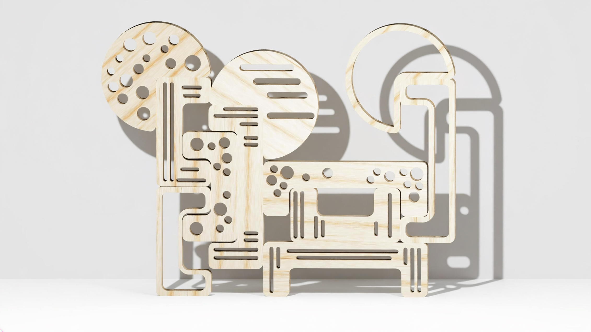
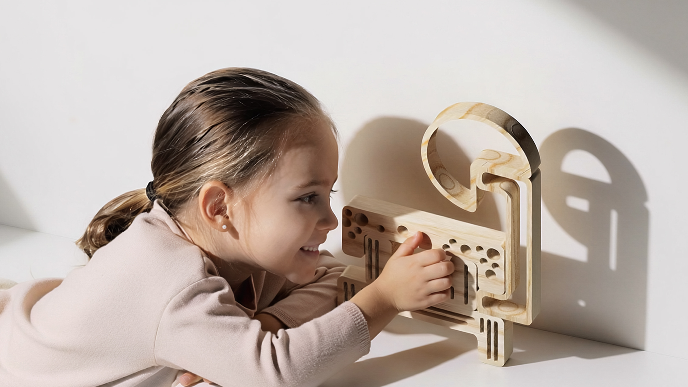

# Texturitas

<!--
  HERO: idealmente uma pseudo-sessão fotográfica do produto
  (ver tutorial Pletor.ai nos Recursos da disciplina, em
  /Recursos/AI_exps/). Usa attachments/hero.jpg para o frontmatter.
-->

> Um conjunto modular de peças geométricas e detalhes orgânicos que ganham tridimensionalidade e vida através da projeção e manipulação da sombra.

## Conceito

I**deia central do produto.** 

O Texturitas é um brinquedo de encaixe e empilhamento composto por formas simples e minimalistas feitas de madeira, com as quais é possível combinar silhuetas geométricas e padrões orgânicos inspirados na natureza.

**Para quem?**

Desenvolvido para crianças com mais de 3 anos.

**Porque?**

Este brinquedo, para além do tato, propõe uma interação com uma fonte de luz, perfurações e rasgos nas peças, transformando blocos de madeira em filtros de luz. Ao projetar estes padrões e texturas nas superfícies envolventes, o objeto passa a ser uma extensão física do próprio brinquedo. Isto estimula a curiosidade, criatividade e exploração da física da luz através do brincar.

## Enquadramento

No contexto de grupo, *Texturitas* foi desenvolvido em primeiro lugar, pois é um brinquedo que se liga diretamente à identidade visual da marca por meio das suas texturas. 

Este brinquedo enquadra-se no grupo através do jogo livre, assim como o *Informal* e o *Rascunho*, promovendo a criatividade e a autonomia das crianças, não havendo, por assim dizer, regras, incentivando a criança a ter liberdade na montagem.

A diferenciação deste projeto para com o grupo é a forma como as peças se juntam com os encaixes por fricção. As formas e texturas orgânicas da natureza também são elementos de diferenciação devido às sombras.

*Texturitas* trabalha a sombra por meio da subtração do material, ao contrário dos 3 projetos do grupo. 

 [contexto](../../contexto.md)

## Tecnologia

Materiais: Pinho tradicional

Processos de fabrico: O corte exterior (contorno) e a abertura dos rasgos lineares e das formas circulares foram executados numa fresadora CNC.

Software paramétrico: Autodesk Fusion 360

- Modelo 3D: <!-- embed Fusion ou link a360.co -->
  
- Ficheiros técnicos: `attachments/`

## Função

**Como se brinca?**

A criança precisa empilhar, encaixar e contrapor as peças texturadas para criar figuras. Em paralelo , o brinquedo permite visualizar a sua silhueta na parede ou no chão por meio de uma fonte de luz. Além disso, dependendo do ângulo e da distância em relação à luz, a sombra sofre distorções e variações de escala. Isto permite que a criança perceba de forma divertida conceitos de proporção, profundidade e movimento através de uma simples parede.

**Idade**: +3 anos

**Montagem** 

Brinquedo com encaixe intuitivo e livre, sem necessidade de ferramentas ou elementos de fixação adicionais. 

**Conformidade com a Diretiva 2009/48/CE.**

*Propriedades Físicas e Mecânicas*: As peças possuem dimensões generosas para evitar riscos de asfixia. Os cantos e detalhes orgânicos arredondados previnem ferimentos por arestas.

*Inflamabilidade e Química*: A madeira é preservada naturalmente em conformidade com a norma EN 71-3.

## Apresentação

Imagens-chave que sintetizam o produto final.

---

## Processo

O percurso completo de iterações, modelos e pesquisa está em [processo.md](../mafalda/processo.md), organizado do **mais recente** para o **mais antigo**.

[Ver processo completo →](../sabrina/processo.md)
