# Processo

## 1. Protótipo(s)

Fotografias em estúdio, com fundo branco, do(s) protótipo(s) final(is).

 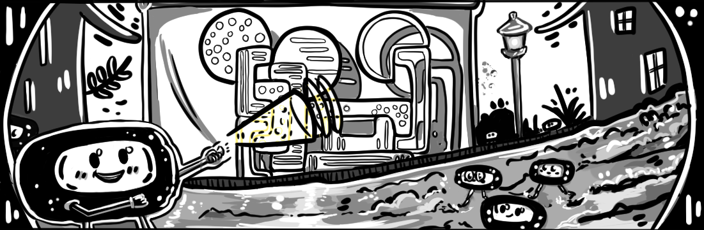

*Protótipo Final*

*Protótipo final - plano geral*

*Protótipo final -  close up*

*Peças Separadas*
## 2. Processo de Prototipagem

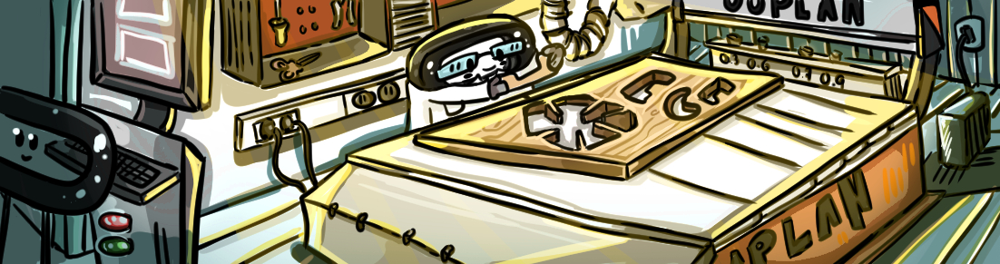

*Peças de pinho por lixar* 

*Cnc da RedSky* 

O processo de prototipagem iniciou-se pela preparação do ficheiro digital, onde as peças foram todas distribuídas numa placa de 600 mm por 800 mm. Após isto, procedeu-se à maquinação na CNC Router da RedSky, que realizou um corte automatizado a partir de uma chapa de pinho. Após o corte da mesma, foi necessário fazer a remoção das farpas à volta da peça com uma lixa de 120. O trabalho de lixagem foi todo executado à mão. 

## 3. Protótipos Exploratórios

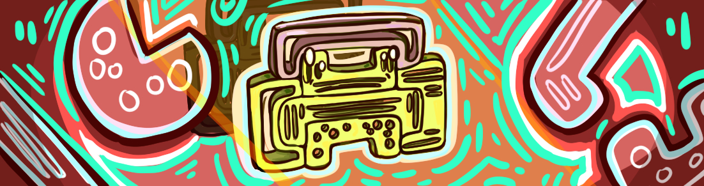

Antes do protótipo final, foram realizados ensaios específicos para a validação das folgas dos encaixes, por meio de um modelo executado em pvc. 

Para o teste de tolerância, o tamanho das folgas utilizadas varia de 0,1 mm a 0,2 mm, o que funcionou corretamente. 

Foram executadas experimentações de projeção através da luz e fotografadas com o objetivo de confirmar se o tamanho do diâmetro dos círculos e dos rasgos gerava sombra suficiente para uma projeção nítida na parede/teto.

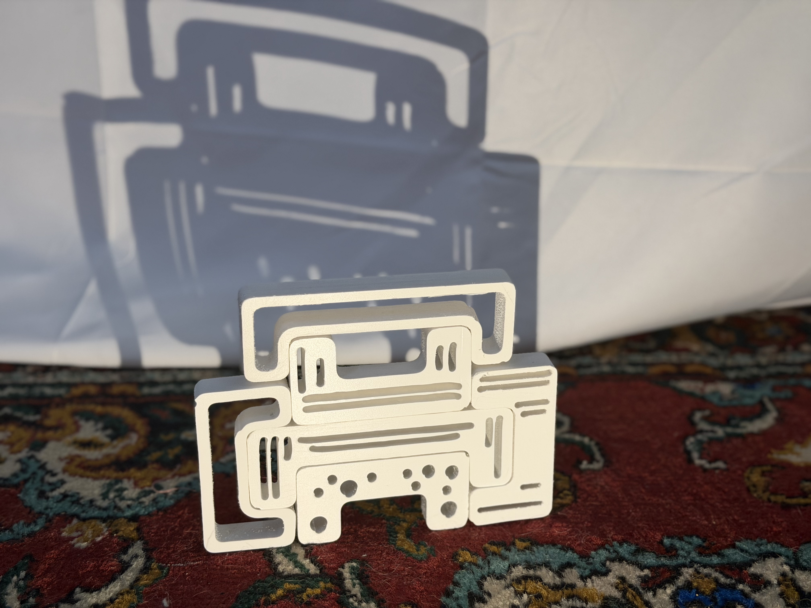
*Imagem do protótipo de pvc montado (posição 1)*

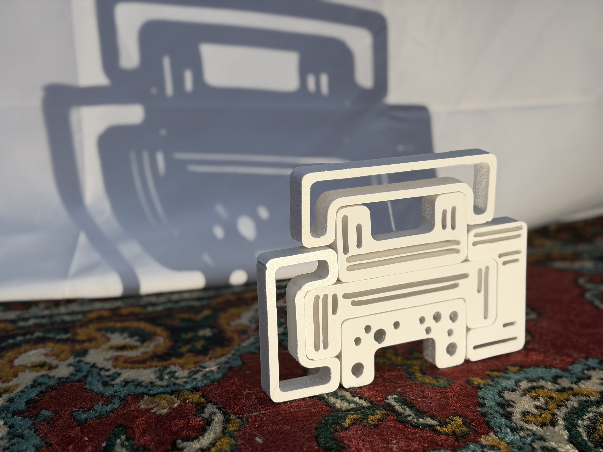
*Imagem do protótipo de pvc montado (posição 1)*

*Imagem do protótipo de pvc montado (posição 2)*

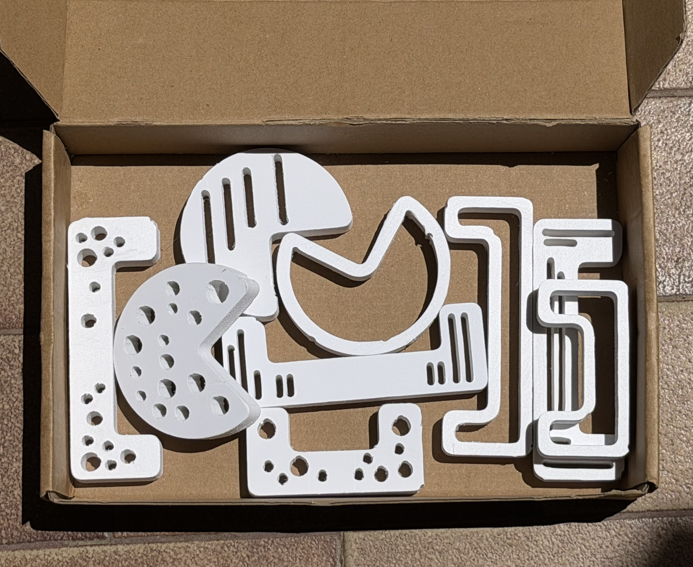
*Imagem das peças lixadas*

 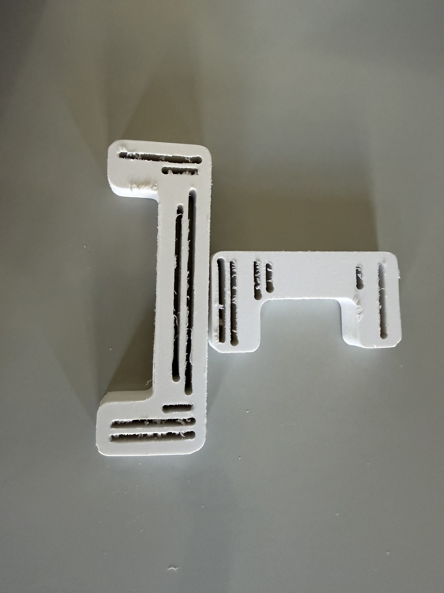
 *Imagem das peças por lixar*
## 4. Modelos 3D

https://a360.co/432911F
https://a360.co/4dGIJIo

## 5. Outros Modelos

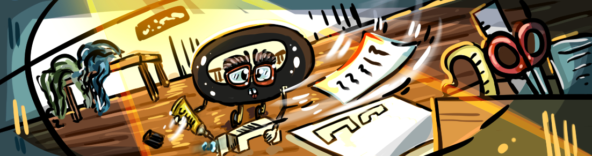

Devido à facilidade em trabalhar melhor no digital, apenas foram feitas maquetes em cartão fino de forma a perceber como as peças iam encaixar e também visualizar as melhores medidas para começar o projeto digitalmente.

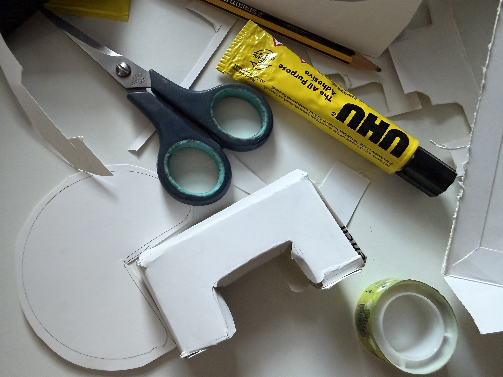
*Maquete com peça pequena*

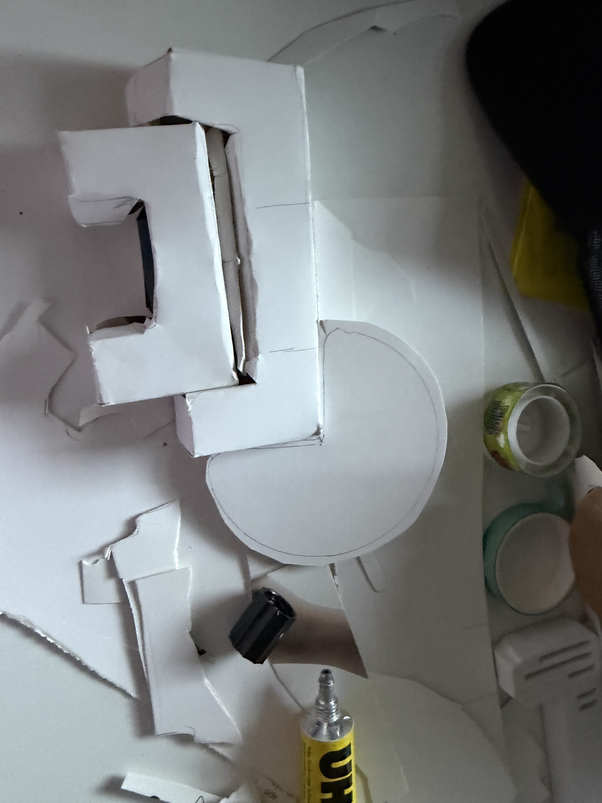
*Maquete com peça pequena e grande (encaixe)*

## 6. Esboços e Pranchas-Resumo

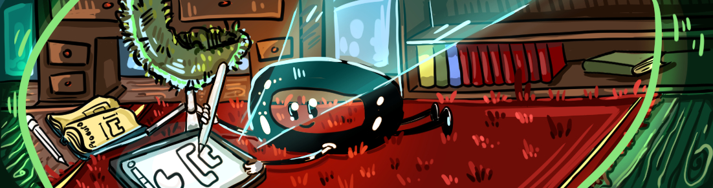

**Pranchas Resumo**

*Prancha resumo final*

No final optei pelo pinho de 15 mm.

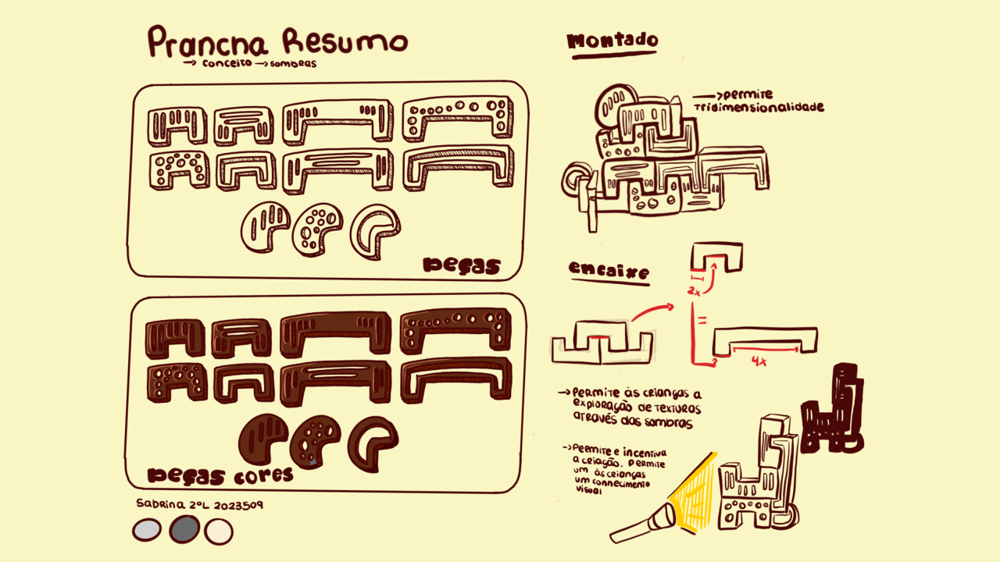
*Prancha resumo (processo)*

Na primeira prancha resumo, com esta dinâmica de peças, foi escolhida uma madeira mais escura e depois foram implementadas cores cinzas. Foi observado que isso não funcionava com as madeiras que possuímos no Fablab. 

**Desenhos manuais - Medidas**

Para as medidas foram escolhidas as que aparecem na imagem devido à conformidade com a Diretiva 2009/48/CE.

O trabalho todo tem apenas 3 medidas de contorno externo de forma a manter o minimalismo. Texturitas é composta pelas peças pequenas (P), grandes (G) e circulares (C).

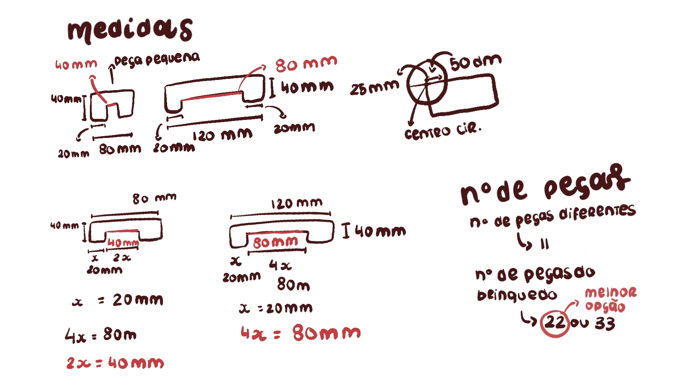
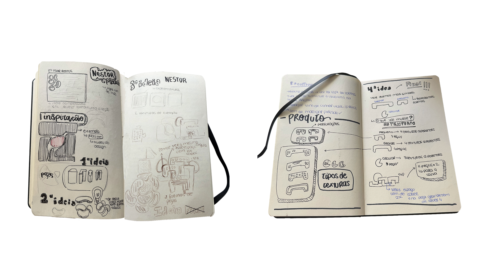
*Esboços no sketchbook*

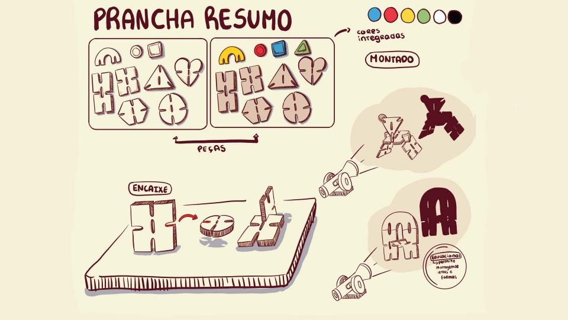
*Primeira prancha resumo*

Na primeira prancha que foi executada nesta unidade curricular, a brincadeira era demasiado evidente e as sombras eram forçadas. Com isto, as crianças iam brincar com o intuito de montar alguma figura e não no sentido de exploração, descartando assim a ideia.
## 7. Pesquisa

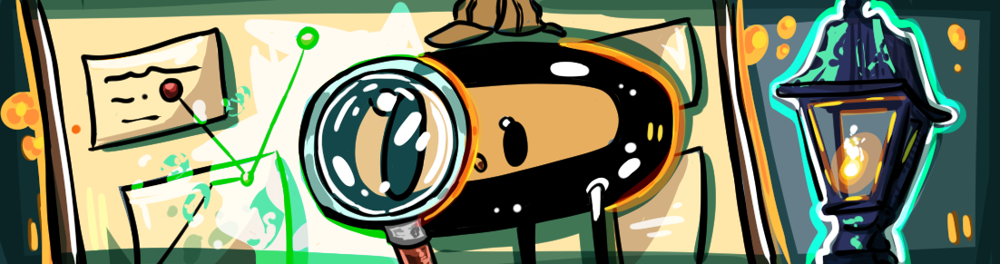
### 7.1. Aspectos valorizados do moodboard, desconstrução da forma (o que distingue o programa formal)

Texturitas distingue-se pela subtração intencional dos materiais para dar origem a uma tridimensionalidade abstrata (sombra). Valorizou-se a estética minimalista através de formas simples e arredondadas, que transmitem um forte sentido de dinamismo. Também se valorizaram as texturas orgânicas.

### 7.2. Objetos de referencia

**Brinquedos Análogos**

**Brinquedos *Montessori*:** pelo uso da madeira ao natural, ressaltando a textura desta.

**Teatro de sombra tradicional:** pelo uso das sombras, como experimentação e aprendizagem de cultura visual, através destas projeções. 

**Referências históricas**

O teatro de sombras é uma arte muito antiga de contar histórias, originária da China. Estes utilizavam bonecos de diversas cores e com detalhes variados.

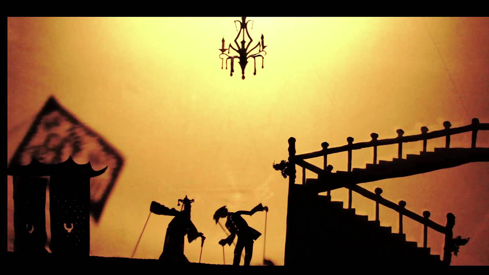
*Teatro de sombras chinês* 
## 8. Outros Elementos

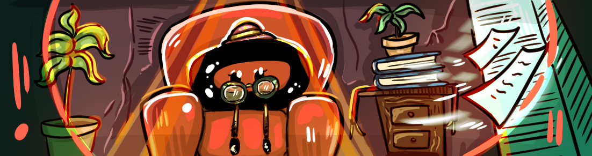

**Livros**

"Elogio da Sombra" - *Jun'ichirō Tanizaki*

Esta leitura contribui para a exploração da cultura oriental, que valoriza a sombra em vez da luz. Esta obra trouxe para o brinquedo a ideia da sombra ser um mistério.

"Light and Shade in Design" - *Vários Autores*

Enquanto que o outro livro ajudou a definir a ideia da brincadeira, este trouxe conhecimentos acerca da física da sombra, o que contribuiu para uma melhor fundamentação sobre a alteração de escalas e a nitidez das silhuetas.

**Inspirações**

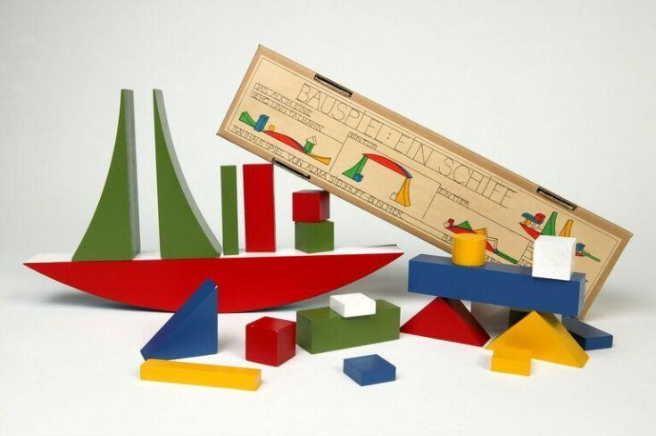
*Ein Schiffbauspiel* ou *Bauhaus Bauspiel / Shipbuilding Game* de *Siedhoff-Buscher*

Este brinquedo é clássico e é composto por 22 peças geométricas de madeira pintadas. Esta inspiração serviu diretamente para a aplicação do minimalismo no brinquedo Texturitas. A abordagem desta designer mostrou que é possível brincar com a redução das peças a formas geométricas simples, o que potencializa a imaginação e a liberdade de montagem. Para além disso, o número de peças (22) obriga as crianças a pensarem numa composição espacial e a exercitarem a sua cultura visual.

Foi através do trabalho de escultura que surgiu a ideia de trazer texturas para o projeto Nestor - Texturitas. Com *Desconforto* consegui ter a perceção da brincadeira através das experimentações de escalas e definição de formas.